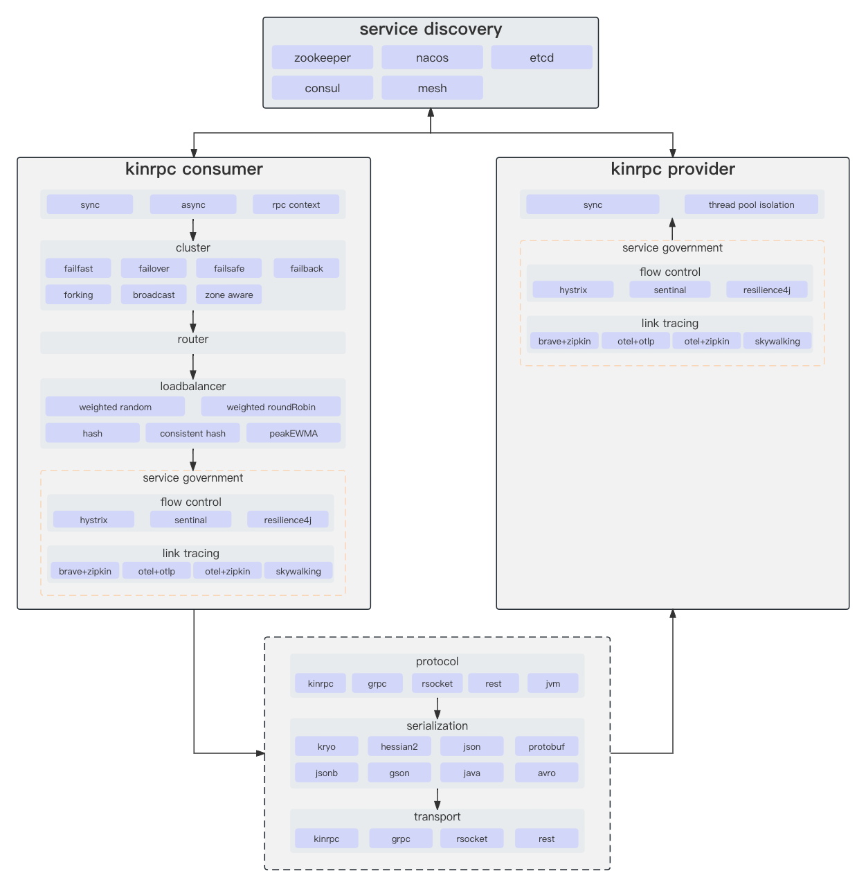

# kin-rpc

高性能RPC框架



## 特性

* 支持基于`zookeeper`, `nacos`, `k8s`, `etcd`和`consul`服务注册订阅, 支持多注册中心和支持应用级服务发现
* 支持服务直连
* 支持负载均衡, 包括: 加权轮询, 加权随机, HASH, 一致性HASH和PeakEWMA等
* 支持服务路由
* 支持多种集群容错方案, 包括`failFast`, `failover`, `failSafe`, `failBack`, `forking`, `broadcast`和`zoneAware`
* 支持`kinrpc`, `grpc`, `rsocket`等协议以及本地(jvm内)调用
* 支持单服务多协议部署
* 支持延迟暴露
* 支持多种序列化方案, 包括`kryo`, `hessian2`, `json`, `protobuf`, `jsonb`, `gson`, `java`和`avro`
* 支持provider端服务方法异步返回结果. 有两种方式, 分别是服务方法返回值定义为`CompletableFuture`, 使用`AsyncContext`
  和基于响应式编程`Mono`.
  不过, 目前还不支持通过cancel操作来取消rpc call, 调用cancel仅能使得future失效, 即没有任何返回值, 但底层逻辑继续执行和完成一次完成的rpc
  call
* 支持线程池隔离
* 支持泛化调用
* 支持`TLS`
* 支持服务方法调用超时, 粘连及异步调用
* 支持基于token的服务鉴权
* 支持参数和返回值为netty `ByteBuf`, 但需要注意的是参数仅支持一个
* 支持服务分组, 服务分版本
* 支持服务调用返回值缓存, 包括`LRU`, `Expiring`和`ThreadLocal`
* 支持reference和service端双重服务方法调用参数校验
* 支持服务降级`hystrix`, `sentinal`和`resilience4j`. 需要注意的是kinrpc原生支持`hystrix`和`sentinal`. 另外,
  要使用`resilience4j`, 则需要配合`springboot`使用, 即使用`@CircuitBreaker`和`@RateLimiter`注解
  在provider或consumer相应方法(需要对reference再封装一层)上面. 最后, 基于springboot+kinrpc开发微服务时,
  就不需要再引入原生支持的`kin-rpc-hystrix`和`kin-rpc-sentinel`依赖,
  使用官方提供的starter更佳, 本质上会对注解方法进行aop方法增强, 避免服务治理重复处理
* 支持基于`Micrometer Observation`和`Micrometer Tracing`作为门面, 桥接`Brave`或`otel`, 并将Tracing信息发送给`Zipkin`
  或`otlp`的链路跟踪

## 实现

### 实现细节

* invoker调用链: cluster invoker -> interceptor invoker -> rpc call invoker -> reference invoker
* 单独使用transport时, 可以自定义processor实现message rpc
* message rpc不支持跨语言
* 去中心化无法使用channel双向通信
* 服务所属不同注册中心的Directory不能合并成一个Directory处理, 因为存在可能其中一个注册中心被单独引用.
  因此每个注册中心都会被视为独立的`ClusterInvoker`处理

### 实现模块

* **kin-rpc**: kin-rpc基础依赖
* **kin-rpc-transport**: kin-rpc传输层模块
  * **kin-rpc-transport-kinrpc**: 自研kinrpc传输层
  * **kin-rpc-transport-api**: kin-rpc传输层api
  * **kin-rpc-transport-grpc**: grpc传输层
  * **kin-rpc-transport-rsocket**: rsocket传输层
* **kin-rpc-cluster**: kin-rpc集群容错模块
* **kin-rpc-protocol**: kin-rpc协议层模块
  * **kin-rpc-protocol-api**: kin-rpc协议层api
  * **kin-rpc-protocol-grpc**: grpc协议
  * **kin-rpc-protocol-jvm**: jvm协议
  * **kin-rpc-protocol-kinrpc**: 自研kinrpc协议
  * **kin-rpc-protocol-rsocket**: rsocket协议
* **kin-rpc-demo**: kin-rpc demo示例
  * **kin-rpc-demo-kinrpc**: 基于kinrpc协议实现rpc通信示例
  * **kin-rpc-demo-jvm**: 基于jvm协议实现rpc通信示例
  * **kin-rpc-demo-grpc**: 基于grpc协议实现rpc通信示例
  * **kin-rpc-demo-api**: kin-rpc demo示例api
  * **kin-rpc-demo-message**: 类actor消息通信示例
  * **kin-rpc-demo-rsocket**: 基于rsocket协议实现rpc通信示例
  * **kin-rpc-demo-provider-starter**: 基于kin-rpc+spring boot实现provider示例
  * **kin-rpc-demo-consumer-starter**: 基于kin-rpc+spring boot实现consumer示例
* **kin-rpc-registry**: kin-rpc注册中心模块
  * **kin-rpc-registry-zookeeper**: zookeeper注册中心
  * **kin-rpc-registry-api**: kin-rpc注册中心api
  * **kin-rpc-registry-direct**: 服务直连
  * **kin-rpc-registry-nacos**: nacos注册中心
  * **kin-rpc-registry-etcd**: etcd注册中心
  * **kin-rpc-registry-consul**: consul注册中心
  * **kin-rpc-registry-kubernetes**: 基于k8s服务发现
  * **kin-rpc-registry-mesh**: 基于mesh服务发现
* **kin-rpc-message**: 类actor消息通信
* **kin-rpc-common**: kin-rpc common模块, 定义配置, 常量以及公共工具类等等
* **kin-rpc-starter**: 整合spring boot, 以spring boot形式实现kin-rpc bootstrap
* **kin-rpc-bom**: kin-rpc依赖统一管理
* **kin-rpc-api**: kin-rpc api模块, 定义rpc相关通用接口和方法
* **kin-rpc-boot**: kin-rpc bootstrap模块
* **kin-rpc-governance**: kin-rpc服务治理模块
  * **kin-rpc-sentinel**: sentinel流控
  * **kin-rpc-hystrix**: hystrix流控
* **kin-rpc-cluster-extensions**: kin-rpc集群容错扩展模块
* **kin-rpc-tracing**: kin-rpc链路跟踪模块
  * **kin-rpc-tracing-api**: kin-rpc链路跟踪api
  * **kin-rpc-tracing-brave-zipkin-starter**: 基于brave+zipkin实现链路跟踪
  * **kin-rpc-observability-autoconfigure**: spring boot下自动加载Micrometer Observation配置
  * **kin-rpc-tracing-otel-zipkin-starter**: 基于otel+zipkin实现链路跟踪
  * **kin-rpc-tracing-otel-otlp-starter**: 基于otel+otlp实现链路跟踪
  * **kin-rpc-tracing-skywalking-starter**: 基于skywalking实现链路跟踪

## 如何使用

[所有示例](https://github.com/huangjianqin/kin-rpc/tree/master/kin-rpc-demo)

### 快速开始

#### Maven依赖

```xml

<dependencies>
  <dependency>
    <groupId>org.kin</groupId>
    <artifactId>kin-rpc</artifactId>
    <version>${kin-rpc.version}</version>
  </dependency>
</dependencies>
```

#### 定义服务接口

```java
public interface DemoService {
  List<User> findAll();

  User find(String name, int age);
}

public class User implements Serializable {
  private static final long serialVersionUID = -7765669138848554424L;

  private String name;
  private int age;

  public static User of(String name, int age) {
    User inst = new User();
    inst.name = name;
    inst.age = age;
    return inst;
  }

  //setter && getter
  public String getName() {
    return name;
  }

  public void setName(String name) {
    this.name = name;
  }

  public int getAge() {
    return age;
  }

  public void setAge(int age) {
    this.age = age;
  }

  @Override
  public String toString() {
    return "User{" +
            "name='" + name + '\'' +
            ", age=" + age +
            '}';
  }
}
```

#### 服务实现

```java
public class DemoServiceImpl implements DemoService {
  private static final List<User> USERS = Arrays.asList(
          User.of("A", 1),
          User.of("B", 2),
          User.of("C", 3),
          User.of("C", 30),
          User.of("C", 31),
          User.of("C", 32),
          User.of("D", 4),
          User.of("E", 5)
  );

  @Override
  public List<User> findAll() {
    return USERS;
  }

  @Override
  public User find(String name, int age) {
    return USERS.stream()
            .filter(u -> u.getName()
                    .equals(name) && u.getAge() == age)
            .findAny()
            .orElseThrow(() -> new IllegalArgumentException("can not find any user"));
  }
}
```

#### 启动Provider

```java
public class DemoServiceApplication {
  public static void main(String[] args) throws Exception {
    try {
      KinRpcBootstrap.instance()
              .app(ApplicationConfig.create("demo-provider"))
              .servers(ServerConfig.kinrpc(13000))
              .service(ServiceConfig.create(DemoService.class, new DemoServiceImpl())
                      .serviceName("demo")
                      .weight(2))
              .start();

      System.out.println("demo service started");
      System.in.read();

      Thread.sleep(2_000);
      System.exit(0);
    } finally {
      KinRpcBootstrap.instance()
              .destroy();
    }
  }
}
```

#### 启动Consumer

```java
public class DemoServiceApplication {
  public static void main(String[] args) throws Exception {
    KinRpcBootstrap.instance()
            .registries(RegistryConfig.direct("kinrpc://127.0.0.1:13000/default:demo:0.1.0.0?serialization=jsonb"))
            .app(ApplicationConfig.create("demo-consumer"))
            .consumer(ConsumerConfig.create()
                    .cluster(ClusterType.FAILOVER))
            .reference(ReferenceConfig.create(DemoService.class)
                    .serviceName("demo"))
            .start();

    DemoService demoService = KinRpcBootstrap.instance().reference(DemoService.class);
    System.in.read();
    System.out.println(demoService.findAll());
    System.out.println(demoService.find("A", 1));

    System.in.read();
    KinRpcBootstrap.instance().destroy();
  }
}
```

### 整合Spring

#### Maven依赖

```xml

<dependencies>
  <dependency>
    <groupId>org.kin</groupId>
    <artifactId>kin-rpc-starter</artifactId>
    <version>${kin-rpc-starter.version}</version>
  </dependency>

  <dependency>
    <groupId>org.springframework.boot</groupId>
    <artifactId>spring-boot-starter-web</artifactId>
    <version>${spring-boot-starter-web.version}</version>
  </dependency>
</dependencies>
```

#### 服务实现

```java

@KinRpcService(interfaceClass = DemoService.class, serviceName = "demo")
public class DemoServiceImpl implements DemoService {
  private static final List<User> USERS = Arrays.asList(
          User.of("A", 1),
          User.of("B", 2),
          User.of("C", 3),
          User.of("C", 30),
          User.of("C", 31),
          User.of("C", 32),
          User.of("D", 4),
          User.of("E", 5)
  );

  @Override
  public List<User> findAll() {
    return USERS;
  }

  @Override
  public User find(String name, int age) {
    return USERS.stream()
            .filter(u -> u.getName()
                    .equals(name) && u.getAge() == age)
            .findAny()
            .orElseThrow(() -> new IllegalArgumentException("can not find any user"));
  }
}
```

#### 启动Provider

基于springboot2, 启动kin-rpc provider并对外暴露之前定义的demo服务

配置application.yml

```yaml
spring:
  application:
    name: demo-provider
server:
  port: 14000
kinrpc:
  server:
    port: 13000
    protocol: "kinrpc"

```

springboot启动类

```java

@SpringBootApplication
@EnableKinRpc
public class DemoServiceApplication {
  public static void main(String[] args) {
    SpringApplication.run(DemoServiceApplication.class);
  }
}
```

#### 启动Consumer

配置application.yml

```yaml
spring:
  application:
    name: demo-consumer
server:
  port: 14001
kinrpc:
  registry:
    address: "kinrpc://127.0.0.1:13000/default:demo:0.1.0.0?serialization=jsonb"
    type: "direct"
```

定义controller

```java

@RestController()
@RequestMapping("/users")
public class ConsumerController {
  @Autowired
  private DemoService demoService;

  @GetMapping("/findAll")
  public String findAll() {
    return demoService.findAll().toString();
  }

  @GetMapping("/find")
  public String find(@RequestParam("name") String name,
                     @RequestParam("age") int age) {
    return demoService.find(name, age).toString();
  }
}
```

springboot启动类

```java

@SpringBootApplication
@EnableKinRpc
@EnableWebMvc
public class DemoServiceConsumerApplication {
  public static void main(String[] args) {
    SpringApplication.run(DemoServiceConsumerApplication.class);
  }

  @KinRpcReference(serviceName = "demo")
  @Bean
  public KinRpcReferenceBean<DemoService> demoService() {
    return new KinRpcReferenceBean<>(DemoService.class);
  }
}
```

consumer启动成功后, 即可通过`localhost:14001/users/findAll`访问demo服务

## 展望

* transport支持rest
* actor支持基于gossip发现集群actor
* metrics
* 协议支持http, 并与springcloud互通
* 支持k8s探针, 暴露http接口访问服务暴露状态, 控制服务上线下线, 需要区分spring和非spring模式, spring模式下可以基于actuator
  endpoint实现, 这样不用重复起http服务
* 分布式事务

